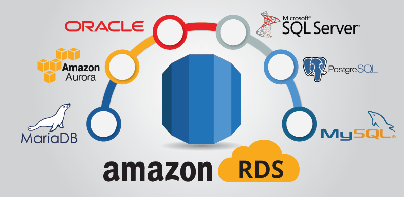

# big-data-challenge - "Alexa, can you handle big data?"

To practice ETL processes in Big Data using PySpark and using AWS's Relational Databases.
  

## Background

Many of Amazon's shoppers depend on product reviews to make a purchase. Amazon makes these datasets publicly available. However, they are quite large and can exceed the capacity of local machines to handle. One dataset alone contains over 1.5 million rows; with over 40 datasets, this can be quite taxing on the average local computer. 

## Objectives

### Level 1

#### Goals:
* To perform the ETL process completely in the cloud and upload a DataFrame to an RDS instance. 
* To use PySpark or SQL to perform a statistical analysis of selected data.

#### Instructions:

* Use the furnished schema to create tables in your RDS database.
* Create two separate ZEPL notebooks and **extract** any two datasets from the list at [review dataset](https://s3.amazonaws.com/amazon-reviews-pds/tsv/index.txt), one into each notebook.
  **Note:** It is possible to ETL both data sources in a single notebook, but due to the large data sizes, it will be easier to work with these S3 data sources in two separate ZEPL notebooks.

* Be sure to handle the header correctly. If you read the file without the header parameter, you may find that the column headers are included in the table rows.

* For each notebook (one dataset per notebook), complete the following:
  * Count the number of records (rows) in the dataset.
  * **Transform** the dataset to fit the tables in the [schema file](../Resources/schema.sql). Be sure the DataFrames match in data type and in column name.
  * **Load** the DataFrames that correspond to tables into an RDS instance. **Note:** This process can take up to 10 minutes for each. Be sure that everything is correct before uploading.

* Consult the troubleshooting guide for handling issues with ZEPL.

* Be sure that every cell begins with `%pyspark` in ZEPL. This specifies the interpreter, and you must have one for each cell. If you import a Jupyter notebook in ZEPL, be sure to delete `%python`, which is automatically added to each cell.

- - -

### Level 2 (Optional)

In Amazon's Vine program, reviewers receive free products in exchange for reviews. Amazon has several policies to reduce the bias of its Vine reviews: [https://www.amazon.com/gp/vine/help?ie=UTF8](https://www.amazon.com/gp/vine/help?ie=UTF8).
  

But are Vine reviews truly trustworthy? This task is to investigate whether Vine reviews are free of bias. Use either PySpark or—for an extra challenge—SQL to analyze the data.

* Create DataFrames to match production-ready tables from two big Amazon customer review datasets.
* Analyze whether reviews from Amazon's Vine program are trustworthy.
* If choosing to use SQL, first use Spark on ZEPL to extract and transform the data and load it into a SQL table on the RDS account. Perform the analysis with SQL queries on RDS.
* Consider steps that can be taken to reduce noisy data, e.g., filtering for reviews that meet a certain number of helpful votes, total votes, or both.
* Submit a summary of the findings and analysis.

- - -

## Navigation of the repo: Submission

* Copy your ZEPL notebooks into Jupyter Notebooks. Add the converted ZEPL notebook to the corresponding folders. This will be the main script to run for analysis. (**Important:** Do not upload notebooks that contain your RDS password and endpoint. Be sure to delete them before making your notebook public!)
* Copy your SQL queries into `.sql` files. Add any SQL queries you used to a `.sql` file and add it to your repo.

## Resources

[customer review datasets](https://s3.amazonaws.com/amazon-reviews-pds/tsv/index.txt)

